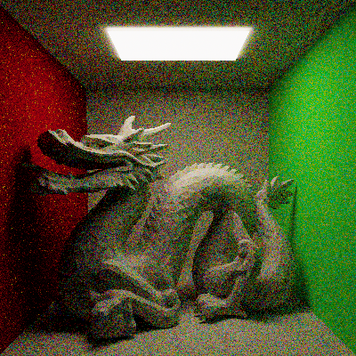

Albedo
===

A community spectral CPU path tracer, made by the Graphics Programming Discord. This is designed to be a path tracer that people can learn from.

Please contribute. If this project doesn't make progress at least once a year, deccer bulies me 😢. Help stop the violence.

(inb4 "all I see is noise")

To-do List
---

- Ray tracer
    - BDPT, MIS, and much much more!
    - More and better sampling strategies
    - Simple lenses and film
    - Tonemapper
    - Post-process denoiser
- Models and materials
    - Use a better material system than bell curves
    - Microfacet importance sampling
- System
    - Some UI showing current render/progress
    - Output to .png instead of ppm